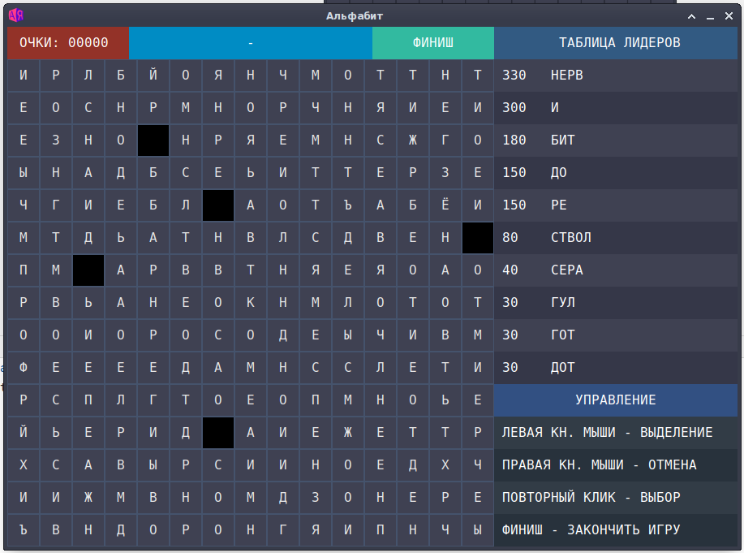

# AlphaBit

## Описание

Вам дано поле размерностью 15x15 - вы составляете русские слова на поле,
из рядом стоящих букв, и вам за это дают очки, в зависимости от длины слова
Первый учебный проект на Rust, на котором буду учиться на этом языке программировать

## Компиляция

cargo build --release

